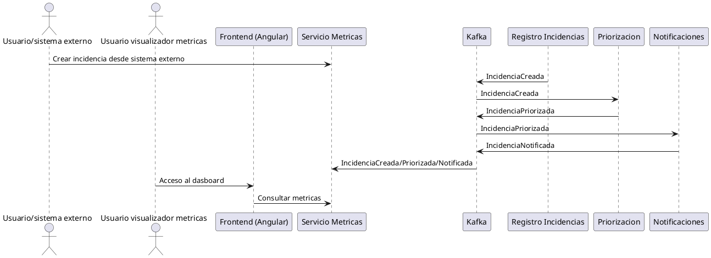

# Plan arquitectonico y didactico - Urban Events

Este documento describe un plan arquitectonico y de desarrollo de software orientado a formacion introductoria en arquitecturas event-driven con Apache Kafka, usando el sistema de ejemplo Urban Events.

## 1. Casos de uso de negocio

- Registro de una nueva incidencia
  - Inicia: Ciudadano/operador desde un sistema externo, para nosotros va a ser una llamada REST al backend que deberia estar bien documentada. Tambien lo podria iniciar algun dispositivo sensor, por lo que va a ser un servicio.
  - Que ocurre: se crea la incidencia en el servicio de Registro, se publica el evento de creacion y el resto de servicios reaccionan de forma asincrona.
  - Servicios: Registro de Incidencias (principal), Priorizacion, Metricas, Notificaciones (en cascada).
- Calculo y ajuste de la prioridad
  - Inicia: Automatico cuando llega una incidencia o cambian reglas.
  - Que ocurre: el servicio de Priorizacion calcula la prioridad y publica el evento de priorizacion; otros servicios actualizan su modelo local. En esta version PMV va a buscar uan serie de palabras clave en la incidencia para determinar la prioridad. Esas palabras se pueden configurar en el arranque del producto.
  - Servicios: Priorizacion (principal), Metricas, Notificaciones.
- Notificacion de incidencias relevantes
  - Inicia: Automatico al recibir incidencias priorizadas o reglas de alerta.
  - Que ocurre: se decide si notificar, se registra la notificacion y se publica el evento. Inicialmente van a ser notificaciones por email a una lista de usuarios por cada tipo de incidencia.
  - Servicios: Notificaciones (principal), Metricas.
- Consulta de metricas agregadas
  - Inicia: Usuario del frontend.
  - Que ocurre: el frontend consulta un modelo de lectura agregado, actualizado por eventos.
  - Servicios: Metricas/Proyecciones (principal), Frontend.

### 1.1. Modelo de dominio para los casos de uso.

- Incidencia: Con id, Tipo (desplegable entre varias opciones), Descripcion, Origen, Timestamp de creacion, Prioridad, Estado (registrado/asignado/en-proceso/resuelta/cancelada), timestamp resolucion y otros campos que veas necesarios. Una forma de guardar su evolucion con timestamp de cada cambio estaria tambien muy bien.
- Notificacion: Con id incidencia, estado, timestamp notificacion 
- Indicadores: las metricas deben recopilarse en indicadores. Define unos busnos indicadores apra ser utilziados en el frontend de visualizacion.

## 2. Mapa de eventos por caso de uso

- Registro de nueva incidencia
  - Eventos: IncidenciaCreada
  - Emisor: Registro de Incidencias
  - Consumidores: Priorizacion, Metricas, Notificaciones (opcional para reglas simples)
  - Orden: Registro -> IncidenciaCreada -> consumo concurrente
- Calculo y ajuste de prioridad
  - Eventos: IncidenciaPriorizada
  - Emisor: Priorizacion
  - Consumidores: Notificaciones, Metricas
  - Orden: IncidenciaCreada -> calculo -> IncidenciaPriorizada
- Notificacion de incidencias relevantes
  - Eventos: IncidenciaNotificada
  - Emisor: Notificaciones
  - Consumidores: Metricas
  - Orden: IncidenciaPriorizada -> decision -> IncidenciaNotificada
- Consulta de metricas agregadas
  - Eventos: IncidenciaCreada, IncidenciaPriorizada, IncidenciaNotificada
  - Emisor: Registro, Priorizacion, Notificaciones
  - Consumidor: Metricas/Proyecciones
  - Orden: consumo independiente, actualizacion eventual del modelo de lectura

Explicacion didactica: cada servicio mantiene su propio estado actualizando su modelo local a partir de eventos publicados por otros servicios. No hay llamadas directas; el contrato es el evento.

## 3. Componentes del sistema

- Servicio de Registro de Incidencias
  - Responsabilidad: creacion y mantenimiento basico de incidencias.
  - Produce: IncidenciaCreada
  - Consume: ninguno (fuente de verdad para creacion)
  - Modelo de datos: Incidencia (id, tipo, ubicacion, estado inicial, timestamps)
- Servicio de Priorizacion de Incidencias
  - Responsabilidad: calcular prioridad con reglas de negocio.
  - Produce: IncidenciaPriorizada
  - Consume: IncidenciaCreada
  - Modelo de datos: Prioridad por incidencia, reglas activas
- Servicio de Notificaciones
  - Responsabilidad: decidir y registrar notificaciones relevantes.
  - Produce: IncidenciaNotificada
  - Consume: IncidenciaPriorizada
  - Modelo de datos: Notificacion (canal, destinatario, estado)
- Servicio de Metricas / Proyecciones
  - Responsabilidad: construir un modelo de lectura agregado.
  - Produce: ninguno (solo lectura)
  - Consume: IncidenciaCreada, IncidenciaPriorizada, IncidenciaNotificada
  - Modelo de datos: metricas agregadas por tipo, prioridad, zona, estado
- Frontend de visualizacion de metricas (Angular 21)
  - Consume: metricas agregadas, estados resumidos
  - Origen: Servicio de Metricas/Proyecciones
  - Razon: evitar acceso directo a servicios de dominio para mantener desacoplamiento y consistencia eventual controlada.

## 4. Infraestructura

- Docker / Docker Compose
  - Contenedores por microservicio + Kafka + PostgreSQL por servicio.
- Apache Kafka 4
  - Brokers: 1-3 para entorno local formativo.
  - Topics: por evento de dominio (ej. incidencias.creadas, incidencias.priorizadas).
  - Productores: cada servicio de dominio.
  - Consumidores: servicios interesados por evento.
  - Consumer Groups: uno por servicio para escalado horizontal y procesamiento distribuido.
- Bases de datos por servicio
  - Cada microservicio con su propio esquema PostgreSQL.
- Servicio de metricas como modelo de lectura desacoplado
  - Mantiene proyecciones para el frontend sin acceder a servicios de dominio.

## 5. Eventos y mensajeria

- Estructura conceptual del mensaje
  - Metadatos: eventId, eventType, timestamp, sourceService, schemaVersion
  - Payload: datos estrictamente necesarios para consumir y actualizar modelos locales.
- Informacion que deben contener
  - Identificador de incidencia, campos relevantes al dominio, datos minimos para actualizar modelos.
- Informacion que no deben contener
  - Datos sensibles, estado interno de servicios, informacion de presentacion.
- Convenciones de naming
  - Eventos: NombreEntidadAccion (ej. IncidenciaCreada)
  - Topics: dominio.entidad.accion (ej. incidencias.creadas)
- Uso de claves Kafka
  - Clave: incidenciaId para asegurar orden por entidad y afinidad en particiones.

## 6. Resiliencia y comportamiento ante fallos

- Procesamiento duplicado de eventos
  - Idempotencia: los consumidores deben ignorar duplicados usando eventId.
- Retrasos en el consumo
  - Consistencia eventual: el frontend refleja estado agregado actualizado en diferido.
- Caidas temporales de servicios
  - Tolerancia a fallos: Kafka retiene eventos, el servicio se recupera y continua.
- Reprocesamiento de eventos
  - Reset de offsets en entorno formativo para reconstruir metricas o corregir errores.

Conceptos didacticos:

- Idempotencia: mismo evento procesado varias veces no cambia el resultado.
- Consistencia eventual: los datos se alinean con el tiempo, no al instante.
- Diseno tolerante a fallos: asumir fallos y permitir recuperacion sin perder eventos.
- Sin patrones avanzados (no Event Sourcing, Saga, CQRS u Outbox).

## 7. Estilo corporativo frontend

- Referencia visual
  - Basarse en el sistema de diseno de la Junta de Andalucia y su Storybook.
  -- https://desarrollo.juntadeandalucia.es/servicios-digitales/diseno-servicios/sistema-diseno
  -- https://storybook.paas.junta-andalucia.es/
  - Paleta: tonos verdes institucionales, neutros calidos, contrastes accesibles.
  - Tipografia: alineada a las directrices corporativas del sistema de diseno.
- Enfoque visual
  - Dashboard inicial con graficas (ng2-charts):
    - Incidencias por tipo (barras)
    - Distribucion por prioridad (donut)
    - Evolucion temporal (linea)
  - Priorizar lectura visual frente a tablas.
- Acceso a datos
  - El frontend consulta unicamente el servicio de Metricas/Proyecciones.
  - Mantiene desacoplamiento y evita dependencias directas con dominios.
- Objetivo didactico
  - Mostrar claramente como el modelo de lectura se alimenta por eventos.

## Diagrama conceptual (PlantUML)

